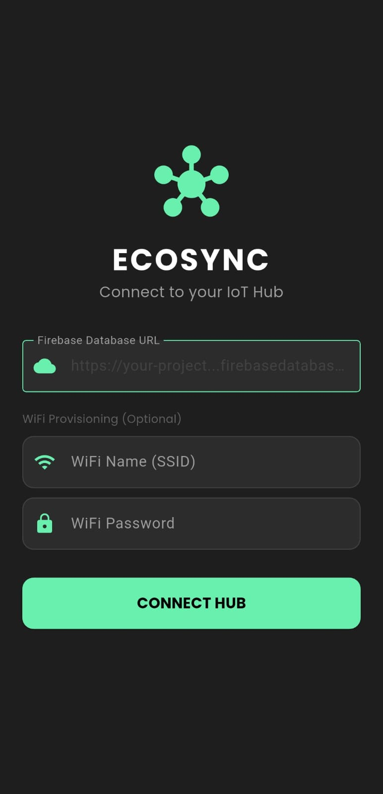
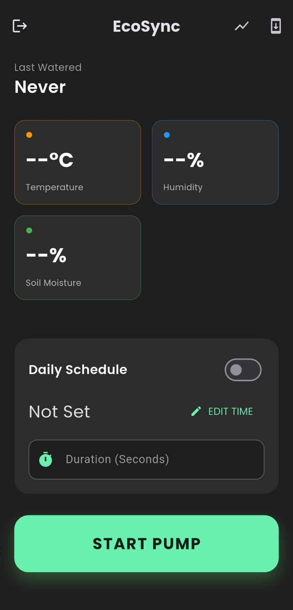
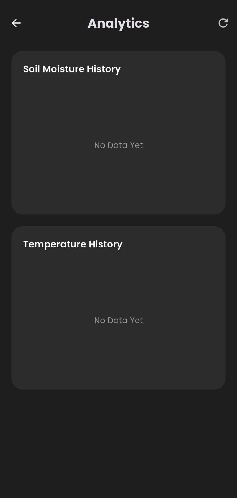

🌱 EcoSync IoT

Smart Automation for a Greener Home

<b>EcoSync</b> transforms your garden into a secure, data-driven IoT ecosystem. 

Control pumps, monitor soil health, and automate watering schedules from anywhere in the world.

Report Bug • Request Feature

📱 Interface Gallery

Secure Hub Login

Real-Time Dashboard

History Analytics

Connect securely to your personal IoT Hub.

Control pump, set schedules, and view sensors.

Visualize temp/moisture trends over 24h.

🚀 Key Features

🔒 Enterprise-Grade Security

Anonymous Authentication: The app performs a silent, encrypted handshake with Firebase.

Database Secrets: Firmware uses privileged Admin tokens to bypass locked rules (auth != null).

Hub Connection: No hardcoded secrets; users connect dynamically via the Login Screen.

⏱️ Precision Automation

Smart Scheduler: Set daily watering times with specific Duration Control (e.g., "Water for 15s at 9:00 AM").

Conflict Resolution: Unified firmware logic prevents "Ghost Switching" between Manual and Auto modes.

Safety Cutoff: Hard-coded dynamic limit prevents flooding even if WiFi fails.

📊 Data Intelligence

History Logger: ESP8266 snapshots sensor data every 60 minutes.

Interactive Graphs: Visualize trends using fl_chart for better plant health insights.

🔄 DevOps & Quality

Auto-Update: The app intelligently checks GitHub Releases and installs new versions (v1.4+) automatically.

Power Optimization: WIFI_NONE_SLEEP mode ensures compatibility with power banks by preventing auto-shutdown.

🏗 System Architecture

The system operates on a Dual-Power Architecture (Solar + Lithium Buffer) and uses a robust REST API protocol.

Component

Responsibility

Frequency

Uplink

Pushes DHT11 (Temp/Hum) and Soil data to Cloud.

Every 10s

Downlink

Polls command queue for instant pump reaction.

Every 200ms

Loglink

Pushes data snapshot to /history for analytics.

Every 1 Hour

🔌 Hardware Stack

MCU: ESP8266 (NodeMCU/Wemos D1 Mini)

Sensors: DHT11, Capacitive Soil Moisture v1.2

Actuators: 5V Relay (Active Low / Open-Drain)

Power: 45x80mm Solar Panel → TP4056 → Li-Ion → 5V Boost

🛠️ Installation Guide

<b>🔌 Firmware Setup (ESP8266)</b>

Clone this repo:

git clone [https://github.com/Pratik4875/SmartGarden_IoT.git](https://github.com/Pratik4875/SmartGarden_IoT.git)

Navigate to Arduino/src/ and open in Arduino IDE or PlatformIO.

Rename secrets_template.h to secrets.h.

Add your WiFi creds and Database Secret (from Firebase Console).

Flash via USB (recommended for v2.3 security update).

<b>📱 App Setup (Flutter)</b>

Navigate to app/.

Install dependencies:

flutter pub get

Run on device:

flutter run

Or download the APK: Go to Releases and install app-release.apk.

📄 License

Distributed under the MIT License. See LICENSE for more information.

Built with 💚 by Pratik4875 using Flutter & ESP8266

